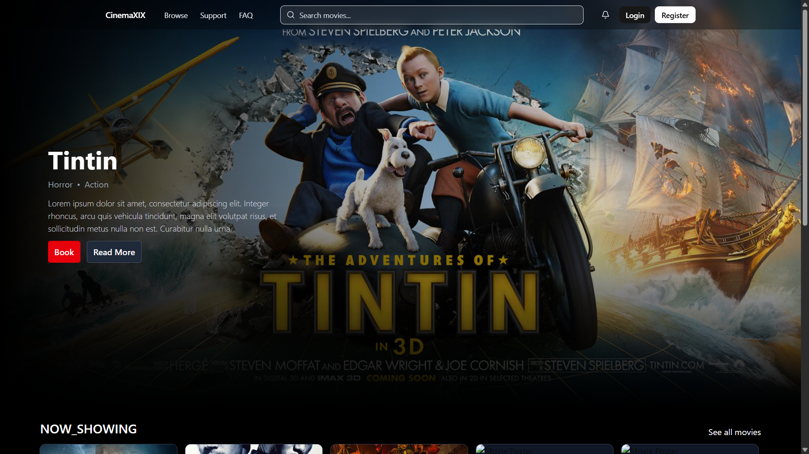
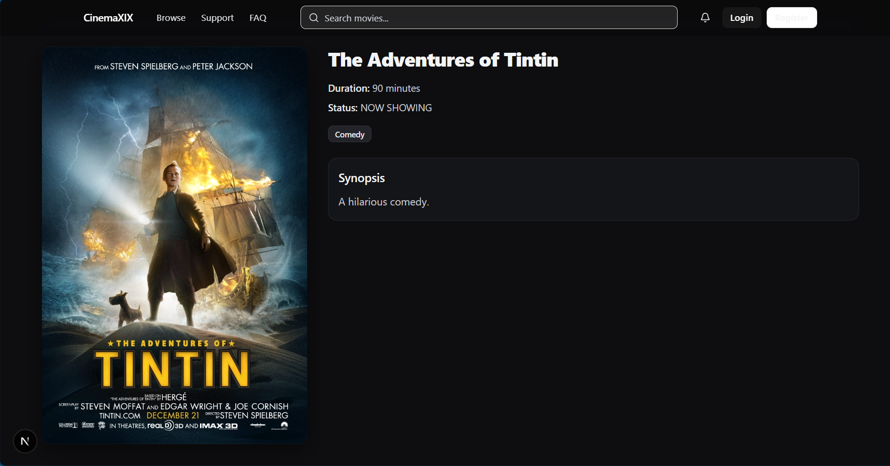
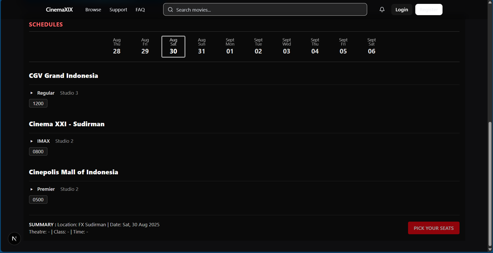

# 🎬 Cinema XIX

Cinema XIX is a modern online **movie booking web application**.  
It lets users browse movies, see schedules, pick seats, book tickets, and pay securely — all in a sleek, responsive UI.

🔗 **Live Demo**: [final-project-fe-faisalfirdaus-3qt4dlqtj.vercel.app](https://final-project-fe-faisalfirdaus.vercel.app/)

---

## ✨ Features

- **Authentication**

  - User registration & login
  - JWT access/refresh token handling
  - Protected profile & bookings pages
  - Admin role support

- **Movies**

  - Browse current & upcoming movies
  - View details, genres, posters, and synopsis
  - Search and filter

- **Showtimes**

  - Per-theater schedules with formats and studios
  - Stylish date strip selector
  - Grouped showtime pills
  - Seat selection with live availability

- **Bookings & Payments**

  - Hold and confirm seat bookings
  - Payment attempts and retry support
  - Booking history under user profile

- **Admin Panel**

  - Manage movies, theaters, studios, showtimes
  - Block seats
  - Manage genres

- **Modern UI**
  - Responsive layout with **Next.js App Router**
  - Styled with **TailwindCSS** + **shadcn/ui**
  - Toast notifications via **sonner**
  - Dark palette inspired by cinema themes

---

## 🛠️ Tech Stack

- **Frontend**: [Next.js 15](https://nextjs.org/), React, TypeScript
- **UI**: TailwindCSS, shadcn/ui, lucide-react icons
- **State/Forms**: React Hook Form + Zod
- **Auth**: Context provider, JWT (access + refresh)
- **Notifications**: sonner
- **Backend API**: RESTful API (`/auth`, `/movies`, `/theaters`, `/bookings`, etc.)
- **Deployment**: Railway (for backend), Vercel/Netlify (frontend)

---

## 📂 Project Structure

```bash
cinema-xix/
├─ app/ # Next.js app directory (pages, routes)
│ ├─ auth/ # Login & register forms
│ ├─ me/ # User profile & bookings
│ ├─ admin/ # Admin dashboard
│ ├─ movies/ # Movie listing & detail pages
│ └─ theaters/ # Theater pages
├─ components/ # Reusable UI + form components
├─ providers/ # Auth context & hooks
├─ lib/ # Zod schemas, utils, API client
├─ public/ # Static assets
└─ README.md
```

---

## 🚀 Getting Started

### Clone & Install

```bash
git clone https://github.com/yourusername/cinema-xix.git

cd cinema-xix

npm install

NEXT_PUBLIC_API_BASE_URL=https://final-project-be-faisalfirdaus-production.up.railway.app

npm run dev
```

Open `http://localhost:3000`

## 🔐 Authentication Flow

- On login/register → receive `access_token` + `refresh_token`

- Tokens are stored securely in localStorage

- `authFetch` wrapper automatically attaches tokens and refreshes on 401

- `useAuth` hook provides:

  - `me`, `ready`, `login`, `register`, `logout`

## 📸 Screenshots (example)

### 🎬 Home Page



### 🎥 Movie Details Page



### 🕒 Showtime Schedule


